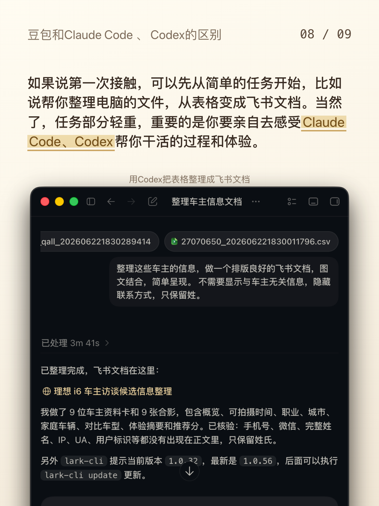
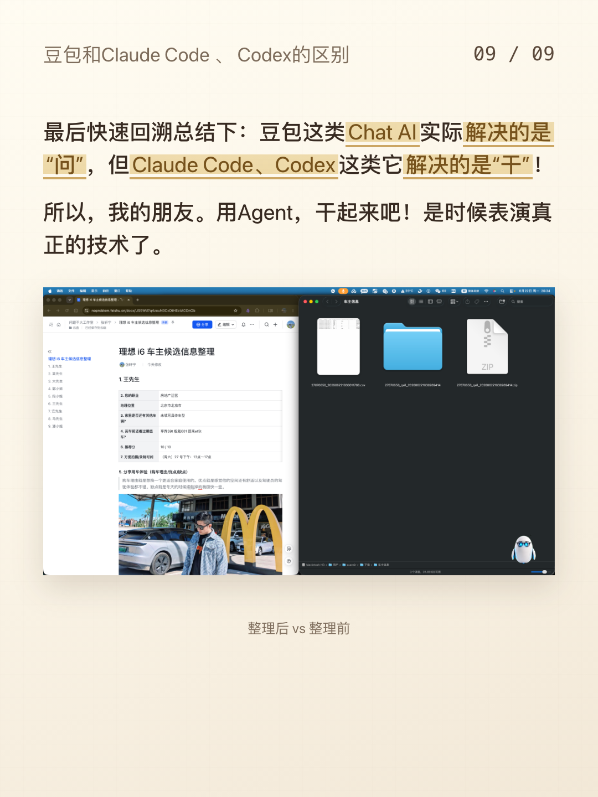

# AI Delivery Plog Skills

Codex skill for creating AI交付局-style vertical Plog/article cards from Feishu/Lark docs, Markdown, Word, or longform articles.

The default workflow produces a browser preview first. PNG export happens only after preview approval, and the recommended export path uses real Chrome/Edge screenshots so the PNG matches the browser preview.

## Showcase






## Features

- 1080x1440 vertical cards
- Source-faithful pagination
- Feishu/Lark image caption preservation
- Browser-adjustable image size
- Vertical-only image dragging while staying centered
- Vertical-only caption dragging while staying centered
- Caption distance stays stable relative to image edge when image size changes
- Real Chrome/Edge screenshot export via local preview server
- Dependency check script for first use

## Install

Copy this folder into your Codex skills directory:

```bash
mkdir -p ~/.codex/skills
cp -R ai-delivery-plog-skills ~/.codex/skills/ai-delivery-plog-skills
```

Restart Codex after installing or updating a skill.

## First Use

Run the dependency check once in a workspace:

```bash
node ~/.codex/skills/ai-delivery-plog-skills/scripts/check-deps.mjs
```

Required:

- Node.js 18+
- Google Chrome, Microsoft Edge, Chromium, or `CHROME_PATH`

Required for Feishu/Lark URLs:

- `lark-cli` configured with user access

## Preview Server

From the folder containing your generated `preview.html`:

```bash
node ~/.codex/skills/ai-delivery-plog-skills/scripts/preview-server.mjs
```

Open:

```text
http://127.0.0.1:8765/preview.html
```

The page buttons call `/api/export-card`, which uses real Chrome/Edge screenshots for PNG output.

## Batch Export

```bash
node ~/.codex/skills/ai-delivery-plog-skills/scripts/export-cards.mjs \
  --input preview.html \
  --out exports/png \
  --prefix ai-delivery-plog
```

## Usage Prompt Examples

```text
用 ai-delivery-plog-skills，把这个飞书文档做成 AI交付局 Plog 卡片预览：<url>
```

```text
用 ai-delivery-plog-skills，把这篇 Markdown 做成 1080x1440 竖向图文卡片，先给网页预览。
```
